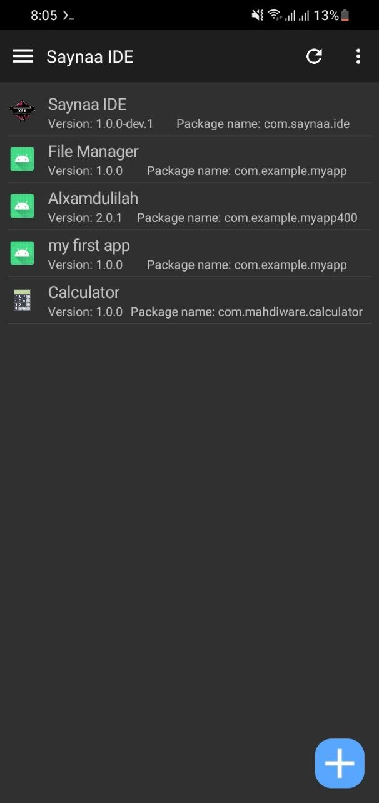
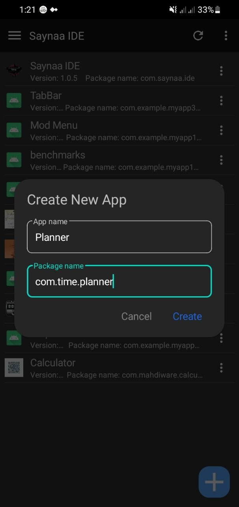
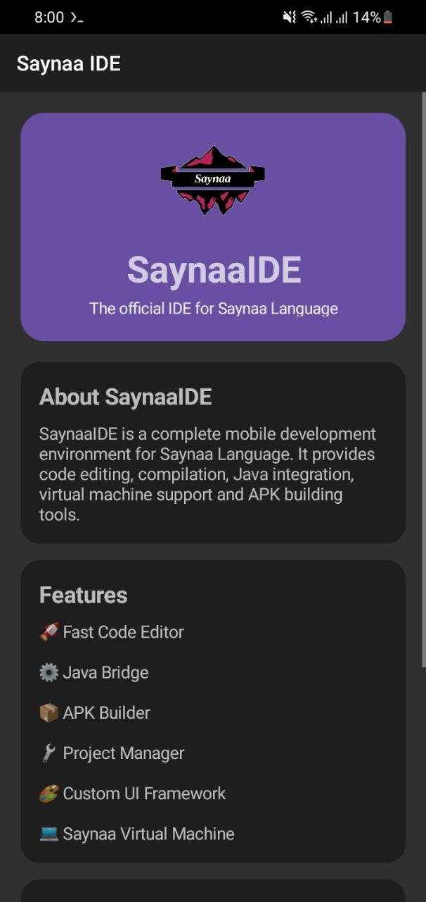
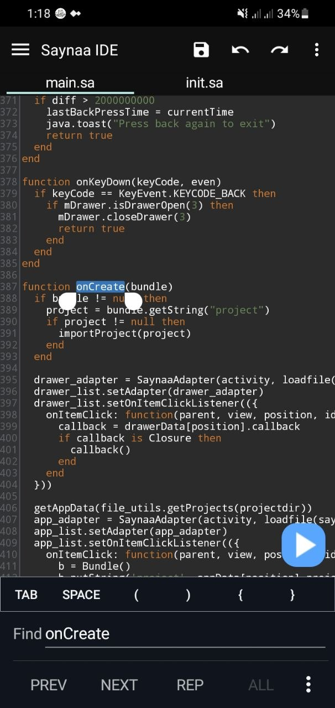
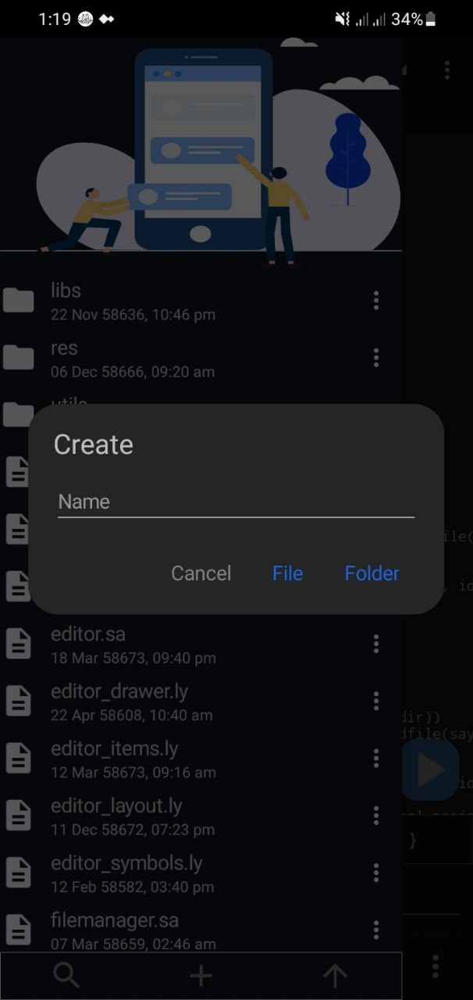
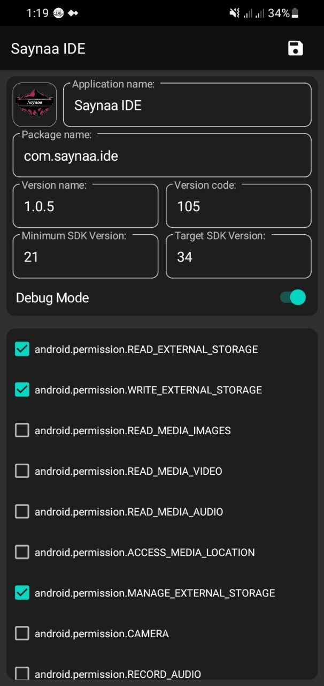
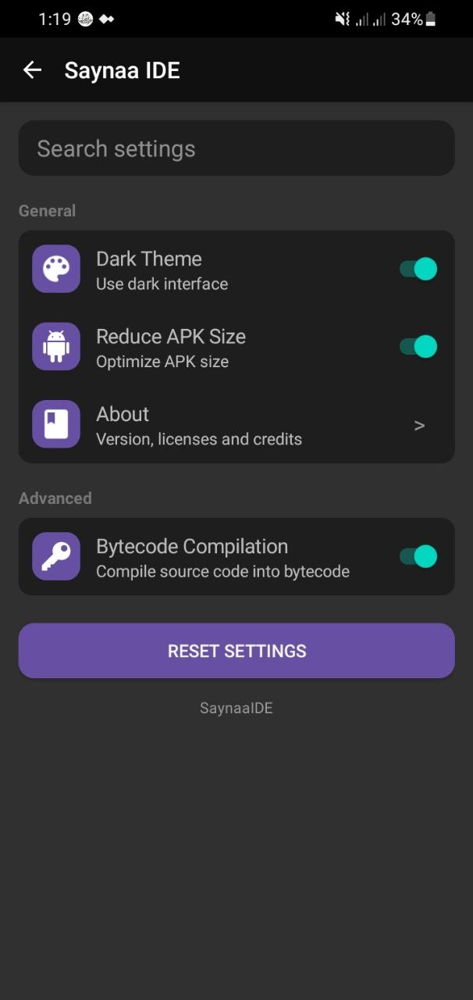
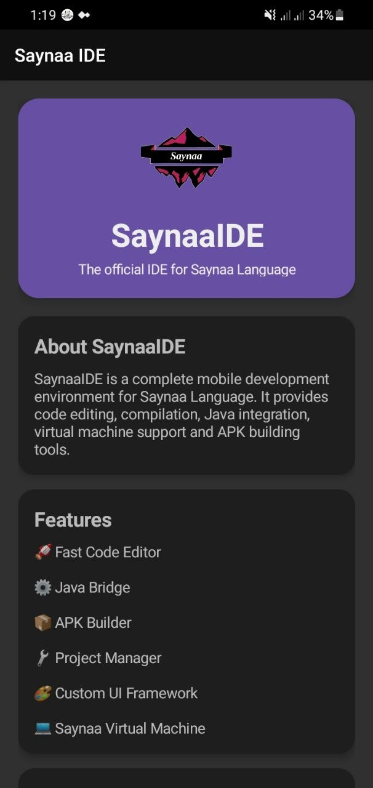

# SaynaaIDE

SaynaaIDE is a lightweight Android IDE for developing applications with the **Saynaa Programming Language**. It provides a complete development environment directly on Android, allowing you to write, run, debug, and build projects without a computer.

## Features

- 🚀 Code editor with syntax highlighting
- 📁 Project manager
- ▶️ Run Saynaa scripts instantly
- 🏗️ Build Android APKs
- 📦 AAPT2 resource compilation
- 📚 File explorer
- ⚡ Fast and lightweight
- 🔧 Android API access
- 🌙 Modern Material Design interface

## Screenshots





<details>
<summary>See more...</summary>







</details>

## Requirements

- Android 5.0 (API 21) or higher
- Storage permission (for projects)

## Installation

1. Download the latest APK from the Releases page.
2. Install the APK.
3. Launch SaynaaIDE.
4. Create a new project and start coding.

## Example

```sa
import "android.widget.*"
import "android.view.*"
import "android.text.*"

function toast(msg)
  Toast.makeText(activity, msg, Toast.LENGTH_SHORT).show()
end

layout = {
  LinearLayout,
  gravity: "center",
  orientation: "vertical",
  {
    TextView,
    text: "Hello SaynaaIDE!",
    textSize: "30sp"
  },
  {
    Button,
    id: "btn",
    text: "Click me",
  }

}

function onCreate(bundle)
  activity.setContentView(loadlayout(activity, layout))
  
  btn.setOnClickListener({
    onClick: function(v)
      toast("app worked")
    end
  })
end
```

## Roadmap

- [x] Code editor
- [x] Project management
- [x] Android UI support
- [x] APK builder
- [x] Code auto-completion
- [ ] Debugger
- [ ] Error diagnostics in Code Editor
- [ ] Git integration
- [ ] Plugin system
- [ ] Visual layout editor

## Contributing

Contributions are welcome! Feel free to open an issue or submit a pull request.

## License

This project is licensed under the MIT License.

## Author

**Mohamed Abdifitaah Jama (Mahdiware)**

- GitHub: https://github.com/mahdiware
